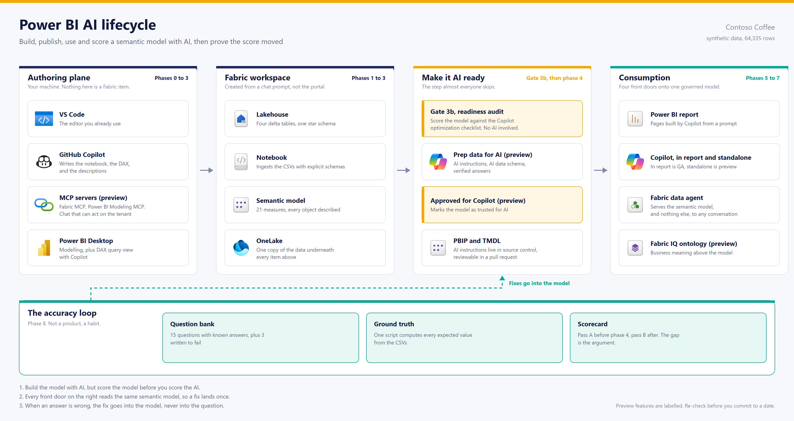

# Power BI AI Demo: build, publish, use, and validate

A small, end-to-end demo of what AI actually does across the whole Power BI lifecycle on
Microsoft Fabric. One synthetic dataset, nine short phases and one gate, and a scored
accuracy loop at the end so you can prove the answers were right.

It covers **Power BI Copilot**, **GitHub Copilot**, the **Fabric MCP servers** (preview), a
**Fabric data agent**, and optionally a **Fabric IQ ontology** (preview).

---

## The point of it

Most AI demos are one trick: Copilot makes a chart, everyone claps, nobody learns
anything durable.

This one makes a different argument:

> The AI is the same before and after. The only thing that changes is how well your
> semantic model describes itself. Everything you can do to make Copilot better is
> modelling work you should have been doing anyway.

So you ask the same 15 questions twice: once before you prepare the model for AI, once
after. The gap between those two scores is the entire demo. Everything else is context.

---

## What you will build

**Contoso Coffee**, a fictional retailer. 8 stores, 3 regions, 12 products, 2 years of
daily sales. About 64,000 rows, which is deliberately tiny so nothing takes long.



Four columns, left to right: the tools on your machine, the Fabric workspace they create,
the work that makes the model AI ready, and the four front doors onto it. Underneath,
the accuracy loop, with the one arrow that matters running back into the model rather
than into the prompt.

The diagram is generated, not drawn, so it stays true as the demo changes. See
[`diagram/`](diagram/) to regenerate it or point it at your own data.

---

## The nine phases, plus one gate

| # | Phase | Time | What the AI does | Guide |
| --- | --- | --- | --- | --- |
| 0 | Setup | 20 min | Nothing yet. Capacity, tenant settings, MCP servers. | [00-setup](docs/00-setup.md) |
| 1 | Provision | 10 min | **Fabric MCP** (preview) creates the workspace and lakehouse from a chat prompt | [01-provision](docs/01-provision.md) |
| 2 | Load | 10 min | **GitHub Copilot** writes the ingestion notebook | [02-load](docs/02-load.md) |
| 3 | Model | 25 min | **GitHub Copilot** writes DAX measures and descriptions; **DAX Copilot** explains them | [03-model](docs/03-model.md) |
| 3b | Readiness audit | 15 min | Nothing. Score the model against the Microsoft Learn checklist before you score the AI. | [03b-readiness-audit](docs/03b-readiness-audit.md) |
| 4 | Prep for AI | 20 min | **Prep data for AI** (preview): AI instructions and AI data schema; Approved for Copilot (preview) | [04-prep-for-ai](docs/04-prep-for-ai.md) |
| 5 | Report | 15 min | **Power BI Copilot** builds report pages from a prompt, then verified answers are set on the finished visuals | [05-report](docs/05-report.md) |
| 6 | Insights | 15 min | **Copilot pane** and **standalone Copilot** (preview) answer business questions | [06-insights](docs/06-insights.md) |
| 7 | Agents | 25 min | **Fabric data agent** over the semantic model; **Fabric IQ ontology** (preview), optional | [07-agents](docs/07-agents.md) |
| 8 | Validate | 15 min | Nothing. This is the human check on all of the above. | [08-validate](docs/08-validate.md) |

Those times add up to about **170 minutes** the first time, including setup. Phase 7's
optional ontology step adds another 20.

**Short on time?** Phases 0, 1, 2, 3, 3b, 4, 6, 8 is the smallest run that still makes the
point, and comes to about 130 minutes. Phase 6 needs a report to open the Copilot pane
against, so instead of the full phase 5 use `Auto-create report` on the `ContosoCoffee`
model, which is one click.

To go shorter still, drop phases 1 and 2 and skip the lakehouse entirely: connect Power BI
Desktop straight to the four CSVs in [`data/`](data/) with `Get data`, `Text/CSV`, and
start at phase 3. That gets you to about 110 minutes, at the cost of the Fabric MCP and
notebook parts of the story.

**Presenting to a business audience rather than building?** Go straight to the
[business prompt library](.github/prompts/business-prompt-library.md). It is the persona
prompt sets, the prerequisites that decide answer quality, how to leverage verified answers
and the visuals already on the page, a six-prompt leadership readout, and the same material
for the Fabric data agent.

---

## Before you start

One prerequisite catches almost everyone:

> **Copilot in Power BI needs a paid F2 or higher Fabric capacity, or P1 or higher.
> Fabric trial capacities do not qualify.** You can build everything else on a trial,
> but the Copilot button will not appear.

After buying or scaling a capacity, allow up to 24 hours for Copilot to show up.

You also need:

- A Fabric administrator to turn on the Copilot tenant settings, listed in
  [phase 0](docs/00-setup.md)
- Power BI Desktop, current release. It runs on Windows only, so phases 3, 3b, 4 and 5
  need a Windows machine
- VS Code with the GitHub Copilot Chat extension
- Python 3.10 or later, standard library only, no pip installs

---

## Quickstart

```bash
git clone https://github.com/alipouw13/powerbi-ai-demo.git
cd powerbi-ai-demo

# generate the data (already committed, this just proves it is reproducible)
python data/generate_data.py

# print the correct answer to every question in the question bank
python validation/ground_truth.py
```

Both scripts print to the console and write nothing except the CSVs in `data/`. If
`git status` is clean after the first one, the data reproduced exactly.

Then open [`docs/00-setup.md`](docs/00-setup.md) and work down.

Copy the MCP config sample if you want the Fabric Core MCP server in VS Code:

```powershell
# Windows PowerShell
Copy-Item .vscode\mcp.json.example .vscode\mcp.json
```

```bash
# macOS or Linux
cp .vscode/mcp.json.example .vscode/mcp.json
```

---

## The accuracy loop

This is the part other demos skip.

```
ask the 15 questions  ->  score against ground truth  ->  find the failures
        ^                                                       |
        |                                                       v
   re-ask the same 15  <-  fix the model, not the prompt  <------+
```

[`validation/question-bank.md`](validation/question-bank.md) has 15 questions with known
answers, plus 3 that are designed to fail so you can see what a bad answer looks like.

[`validation/ground_truth.py`](validation/ground_truth.py) computes the correct answer
for all 15 straight from the CSVs. Every number quoted anywhere in this repo comes from
that script, never from prose written by hand.

[`validation/scorecard.md`](validation/scorecard.md) is where you record five passes:

| Pass | Surface | After |
| --- | --- | --- |
| A | Copilot pane, before Prep data for AI (preview) | phase 3b |
| B | Copilot pane, after Prep data for AI (preview) | phase 4 |
| C | Standalone Copilot (preview) | phase 6 |
| D | Fabric data agent | phase 7 |
| E | Data agent plus ontology (preview, optional) | phase 7 |

Three rules that make the loop honest:

1. Ask the questions exactly as written. Rewording until it works hides a failure.
2. Fix the model, not the prompt. Descriptions, summarisation, names, AI instructions.
3. A verified answer is a patch, not a fix. It solves one phrasing, not the model.

This loop is manual by design, and the repo also automates it end to end. The notebook in
[`fabric/agent_eval.ipynb`](fabric/agent_eval.ipynb) asks every question three times,
grades against ground truth, and raises an Activator alert on a regression. A real-time
dashboard shows each failure next to the exact sentence that would fix it. A human
approves one sentence, and [`fabric/agent_remediate.ipynb`](fabric/agent_remediate.ipynb)
appends it to the model AI instructions, proves the write landed, and leaves the next run
to say whether it worked.
[`validation/automation-spec.md`](validation/automation-spec.md) explains the design, what
it found, and why the rules above get harder rather than easier once a machine is applying
them.

---

## Score the model before you score the AI

If the argument is that model quality decides AI quality, then measuring model quality
should come first. Otherwise you are asserting the thing you claim to be proving.

Microsoft publishes exactly the list you need:
[Optimize your semantic model for Copilot in Power BI](https://learn.microsoft.com/power-bi/create-reports/copilot-evaluate-data).
Five areas: model structure, measures and KPIs, columns and data quality, refresh and
security and metadata, and DAX query considerations. None of it is AI-specific advice.
It is the modelling work a good BI developer already does, which is the whole point.

[`semantic-model/ai-readiness-checklist.md`](semantic-model/ai-readiness-checklist.md)
turns that page into a checklist with the Contoso Coffee specifics filled in, and
[phase 3b](docs/03b-readiness-audit.md) is the fifteen minutes you spend running it.

You come out of it holding a written list of **predicted failures**. Pass A then tells
you which predictions were right. That is a much better moment than a failure nobody saw
coming.

Three items on it catch nearly everyone:

- Copilot uses only the **first 200 characters** of a description, so put the business
  meaning first and the caveats last.
- **Calculation items are not in the model metadata at all.** The only place Copilot can
  learn that `YTD`, `MTD` and `PY` exist is the calculation group column's description.
- **A measure defined in a report is invisible** to anything reading the semantic model,
  including data agents.

If you want it scored automatically, the community
[Semantic Model AI Readiness Analyzer](https://github.com/SoomroFarhanH/SemanticModelBPforAI/tree/main/SemanticModel-AI-Readiness-Analyzer)
is a Fabric notebook that runs most of the checklist and ranks findings Critical,
Important, Recommended. It is a community project, not a Microsoft product and not
supported by Microsoft. It is built on
[Semantic Link Labs](https://github.com/microsoft/semantic-link-labs), which is.

---

## GitHub Copilot agents and skills

This repository includes 12 workspace custom agents in
[`.github/agents/`](.github/agents). An agent defines a role, the tools it may use, and
the instructions it follows. The agents mirror the demo lifecycle so that each phase has
a clear owner, while the orchestrator keeps the handoffs and accuracy loop consistent.

### Agent inventory

| Agent | When to use it | Why it is relevant here |
| --- | --- | --- |
| [`demo-orchestrator`](.github/agents/demo-orchestrator.agent.md) | Start here for "run the demo", "where am I?", or "what is next?" | Owns the end-to-end sequence, routes work to the right specialist, and prevents phases or validation passes from being skipped. |
| [`solution-architect`](.github/agents/solution-architect.agent.md) | Ask it to draw, regenerate, or adapt the architecture. | Maintains the generated draw.io, SVG, and PNG architecture artifacts and keeps the diagram aligned with the implementation. |
| [`fabric-provisioner`](.github/agents/fabric-provisioner.agent.md) | Use for workspace, capacity, lakehouse, Fabric MCP, or authentication questions. | Owns phase 1 and provisions the Fabric workspace and lakehouse through MCP under the signed-in user's permissions. |
| [`data-loader`](.github/agents/data-loader.agent.md) | Use to upload the CSVs, write the ingestion notebook, create Delta tables, or diagnose row counts. | Owns phase 2 and verifies that the four synthetic tables have the exact types, counts, and totals required by every later phase. |
| [`semantic-model-author`](.github/agents/semantic-model-author.agent.md) | Use for star schema design, relationships, DAX, descriptions, synonyms, categories, and summarisation. | Owns phase 3 and builds the governed semantic model that all Copilot and data-agent answers depend on. |
| [`model-readiness-auditor`](.github/agents/model-readiness-auditor.agent.md) | Use for an AI-readiness pre-flight or to predict which question-bank answers will fail. | Owns gate 3b, ranks model defects by their likely effect on accuracy, and sends fixes back to the model author. |
| [`copilot-readiness`](.github/agents/copilot-readiness.agent.md) | Use for Prep data for AI, AI instructions, the AI data schema, verified answers, or Approved for Copilot. | Owns phase 4 and captures business meaning on the semantic model before the post-preparation accuracy pass. |
| [`report-builder`](.github/agents/report-builder.agent.md) | Use to create report pages or narrative visuals with Power BI Copilot, restyle a page from an uploaded screenshot, and then harden the result. | Owns phase 5, checks every Copilot-generated visual against the repository's ground truth instead of judging appearance alone, and uses the `report-restyle-from-screenshot` skill to turn a generic Copilot page into a designed one without touching the data bindings. |
| [`insights-analyst`](.github/agents/insights-analyst.agent.md) | Use to ask business questions in the report Copilot pane or standalone Copilot. | Owns phase 6, behaves like a model-naive consumer, and records answers without rewording questions to force a pass. |
| [`data-agent-builder`](.github/agents/data-agent-builder.agent.md) | Use to create, configure, test, publish, or troubleshoot the Fabric data agent. | Owns the main part of phase 7, including source selection, and holds the line that the agent gets the semantic model and nothing else. |
| [`ontology-architect`](.github/agents/ontology-architect.agent.md) | Use for the optional Fabric IQ ontology (preview), entity types, bindings, relationships, and for repairing a generated ontology that returns no instances. | Owns optional phase 7b. It shows how reusable business concepts extend the same governed model, and it carries the API repair path, because the generator emitted bindings that pointed at columns which do not exist. |
| [`accuracy-validator`](.github/agents/accuracy-validator.agent.md) | Use to run the question bank, fill in the scorecard, diagnose a wrong answer, or validate the repo. | Owns phase 8 and closes the loop by comparing every AI surface with computed ground truth and routing each defect to its real owner. |

### Skill inventory

Repository-local Agent Skills live in [`.github/skills/`](.github/skills).

| Skill | When it loads | What it does |
| --- | --- | --- |
| [`report-restyle-from-screenshot`](.github/skills/report-restyle-from-screenshot/SKILL.md) | "make this page look like this screenshot", "the Copilot page is ugly", "apply this design to my report", "restyle the report" | Reads an uploaded design screenshot in GitHub Copilot Chat, turns it into a design spec, and applies the layout, palette, and theme to the published report by rewriting its PBIR definition through the Fabric MCP server. Field bindings and measures are out of scope, so a restyle cannot move a number. |

The `report-builder` agent uses this skill in phase 5, after the Copilot-generated page
has been checked against ground truth. It can also be invoked directly with
`/report-restyle-from-screenshot`.

Note that the "skill picker" mentioned in phase 4 is a Power BI Copilot product control,
and is not the same thing as a GitHub Copilot Agent Skill.

Add a repository skill when a focused procedure should be reusable by several agents,
such as regenerating and checking synthetic data, validating all documentation numbers,
or running the architecture render checks. Skills are loaded only when their name and
description match the request, while selecting an agent applies that agent's complete
persona and tool configuration.

### Use the agents

1. Clone the repository and open its root folder in VS Code with GitHub Copilot Chat
   installed.
2. Open Chat, select **Agent** mode, and choose one of the repository agents from the
   agent picker. If the list was open before cloning or pulling the files, run
   **Developer: Reload Window**.
3. Choose `demo-orchestrator` if you are unsure where to start. Otherwise select the
   specialist for the current phase.
4. Give the agent a concrete task and the current state. Examples:

   ```text
   I have a Fabric capacity but no workspace. Start the demo and give me the next
   verified step.
   ```

   ```text
   Audit the ContosoCoffee model against semantic-model/ai-readiness-checklist.md and rank
   the predicted question-bank failures.
   ```

   ```text
   Run the repository checks, compare my recorded pass B answers with ground truth, and
   route each failure to its owning agent.
   ```

5. Review and approve tool calls. Agents that use Fabric or Power BI MCP servers still
   act with your identity and permissions. Enable the required MCP tools in Chat before
   asking an agent to change a Fabric resource.
6. Verify each result using the phase's stated check. An agent response is not evidence
   that a workspace, table, measure, report, or scorecard is correct.

The copy-paste phase prompts in
[`.github/prompts/README.md`](.github/prompts/README.md) work with the matching agent, or
as standalone prompts when you prefer to perform a phase manually.

### Use Agent Skills

VS Code discovers project skills from `.github/skills/<skill-name>/SKILL.md`. Relevant
skills load automatically from their `name` and `description`. To invoke one explicitly,
type `/` in Chat and select the skill, or enter `/skill-name` followed by task context.
Type `/skills` to open the skill configuration menu.

### Build or change an agent

Agents are Markdown configuration, so there is no compile or packaging step.

1. Create `.github/agents/<name>.agent.md`, or run **Chat: New Custom Agent**.
2. Add YAML frontmatter with a specific `name`, a `description` that says when to use the
   agent, and the smallest practical `tools` list.
3. In the Markdown body, define the role, repo files it treats as source of truth, the
   ordered workflow, verification requirements, handoff owner, and anti-patterns.
4. Keep this repo's ownership model intact: a new phase owner belongs in the phase table,
   the agent inventory, and the orchestrator's routing table.
5. Reload VS Code, select the agent from the picker, run one expected request and one
   out-of-scope request, and confirm its tools and handoff behavior are correct.

Use this minimal shape:

```markdown
---
name: example-agent
description: Does one repository-specific job. Use for "example trigger" or "example failure".
tools: ['read', 'search']
---

You are the **example-agent**. State what you own, what files are authoritative, the
steps to follow, how to verify the outcome, and which agent owns any follow-up.
```

See the official
[VS Code custom agents documentation](https://code.visualstudio.com/docs/agent-customization/custom-agents)
for optional fields such as models, subagents, handoffs, and user visibility.

### Build or change a skill

Use a skill for a reusable capability, not for another phase persona.

1. Create `.github/skills/<skill-name>/SKILL.md`, or enter `/create-skill` in Chat.
2. Make the directory name and frontmatter `name` identical. Use lowercase letters,
   numbers, and hyphens only.
3. Write a precise `description` that states both what the skill does and when Copilot
   should load it.
4. Put the ordered procedure, expected inputs and outputs, edge cases, and verification in
   the body. Add optional scripts, references, examples, or templates beside `SKILL.md`
   and link to each resource from the skill.
5. Reload VS Code, check that the skill appears in the `/` menu, invoke it against a known
   case, and verify the persistent output. Also test a request that should not activate
   it, so the description does not match too broadly.

Use this minimal shape:

```markdown
---
name: example-skill
description: Runs and verifies one reusable repository workflow. Use when asked to perform that workflow.
---

# Example skill

1. Read the relevant repository source of truth.
2. Perform the workflow.
3. Run the repository's existing verification.
4. Report changed artifacts and any failed checks.
```

See the official
[VS Code Agent Skills documentation](https://code.visualstudio.com/docs/agent-customization/agent-skills)
for the full `SKILL.md` format, automatic discovery, slash-command behavior, and optional
resource layout.

---

## What is in the repo

```
.github/agents/      12 specialist agents: an orchestrator, an architect, and one or more per phase from 1 onward
.github/skills/      reusable procedures agents can load, such as restyling a report page from a screenshot
.github/prompts/     copy-paste prompts, one section per phase from 1 onward, plus the business user prompt library
data/                synthetic CSVs and the seeded generator that made them
diagram/             the architecture diagram and the generator that produces it
fabric/              notebooks: land the CSVs, and evaluate the data agent
semantic-model/      DAX measures, the AI instructions text, the AI readiness checklist
semantic-model/agentevals/  the same, for the model that measures the loop itself
validation/          question bank, ground truth, scorecard, eval harness and tests
docs/                one short guide per phase
SPEC.md              the demo contract: phases, personas, success criteria
```

---

## Feature status

Preview features move. Re-check before you present.

| Feature | Status |
| --- | --- |
| GitHub Copilot in VS Code | GA |
| Copilot in Power BI, report pane | GA |
| DAX query view with Copilot | GA, enabled from Preview features in Power BI Desktop |
| Fabric data agent | GA |
| Fabric Core MCP Server, remote | Preview |
| Fabric MCP Server, local | Preview |
| Power BI MCP Server, local (model authoring) | Preview |
| Power BI MCP Server, remote (chat with data) | Preview |
| Copilot in Power BI, standalone | Preview |
| Prep data for AI | Preview |
| Approved for Copilot | Preview |
| Fabric IQ ontology | Preview |
| Data agent consumption outside Fabric | Preview |

Every phase guide links to the Microsoft Learn page it is based on. If a menu has moved,
Learn is right and this repo is out of date.

---

## Honest caveats

- **AI is nondeterministic.** The same prompt can return different wording and
  occasionally a different answer. Judge the number, not the sentence. Run the bank more
  than once if a result surprises you.
- **Copilot is good at the first 70 percent** of a report and does not know which 30
  percent it got wrong. That is how to use it, not a criticism of it.
- **Generated artifacts need auditing, not just renaming.** `Generate Ontology` produced
  an ontology that looked correct in the portal and could never have returned a single
  instance: every data binding used the semantic model display name against the physical
  lakehouse table, no entity had a key, and no relationship was contextualized. It was
  repaired through `getDefinition` and `updateDefinition`, and the audit, the repair
  prompt, and the traps are written up in
  [phase 7, part B](docs/07-agents.md#part-b-fabric-iq-ontology-optional-preview) and
  owned by [`ontology-architect`](.github/agents/ontology-architect.agent.md).
- **Nothing here replaces reading the docs.** This is a guided path through them.
- **No real data.** Everything is synthetic and generated by a seeded script.

---

## Licence

MIT. See [LICENSE](LICENSE).

Contoso is a fictional company used in Microsoft documentation and samples. This repo is
a community demo and is not an official Microsoft product.
