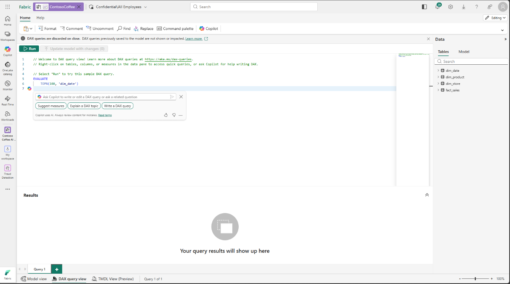
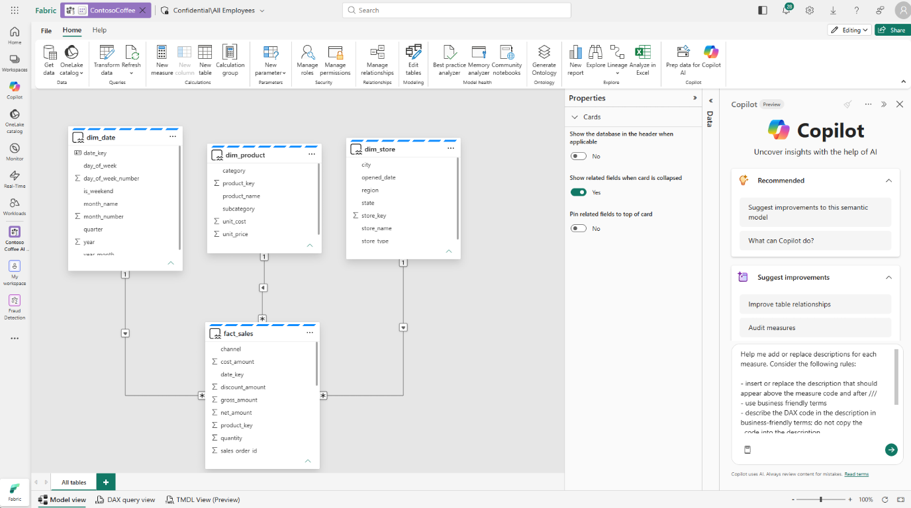

# Phase 3. Build the semantic model

**Agent:** `semantic-model-author`
**Time:** 25 minutes
**AI on show:** Power BI MCP server (local, preview) driving the model from Copilot Chat,
Copilot in Fabric for measures and descriptions, GitHub Copilot to review the set,
DAX query view with Copilot

This is the phase that decides whether phases 5, 6 and 7 succeed. Copilot cannot be
better than the metadata you give it. Everything after this is downstream of the work
you do here.

---

## Create the model

From the `LH_ContosoCoffee` lakehouse ribbon, select `New semantic model`. Name it
`ContosoCoffee`. Select all four tables. This gives you a Direct Lake model.

Alternatively, connect Power BI Desktop to the lakehouse and build an Import model. The
demo works either way. Note that in phase 4, Power BI Desktop supports Prep data for AI
only on Import, DirectQuery, and Composite (local) models, while the Power BI service
supports all model types including Direct Lake.

---

## How you edit the model: pick one

Everything below can be done by hand in Power BI Desktop. It can also be done by asking,
which is the point of the demo.

| Surface | Use it for | Status |
| --- | --- | --- |
| **Power BI MCP server, local** | Bulk edits: relationships, descriptions, summarisation, data categories, renames, DAX validation. Works against Desktop, a Fabric workspace, or a PBIP/TMDL folder. | Preview |
| Copilot in Fabric, model view and DAX query view | Suggesting measures, writing measure descriptions, critiquing the model in place | GA |
| GitHub Copilot in VS Code on the PBIP/TMDL folder | Drafting text, reviewing diffs, auditing the measure set, anything that is really a file edit | GA |
| DAX query view with Copilot | Writing and explaining a single query | GA |
| Power BI Desktop UI | The five clicks that are faster than a prompt | GA |

**Use the local MCP server as the default for this phase.** Microsoft Learn lists exactly
this workload — "apply modeling best practices across an existing semantic model in bulk"
and "refactor TMDL or Power BI Project files as part of an agentic development workflow" —
as what it is for. Doing the twelve items below one dialog at a time is the slow path.

### Set it up

Install the `analysis-services.powerbi-modeling-mcp` VS Code extension, open the model in
Power BI Desktop, then in Copilot Chat:

```text
Connect to semantic model 'ContosoCoffee' in Fabric Workspace 'Contoso Coffee AI Demo'
```

After it connects, prompt GitHub Copilot:

```text
analyze my tables and create a model with proper relationships so i can create dax measures and a report
```

When Copilot finishes, verify the result before continuing:

1. Ask Copilot to list every relationship it created, including the columns, cardinality,
   cross-filter direction, and whether the relationship is active.
2. In Power BI Model view, compare that list with the three expected relationships in the
   [Relationships](#relationships) section below.
3. Confirm each relationship is active, many-to-one from `fact_sales` to its dimension,
   and uses single-direction filtering. Remove any extra fact-to-fact, dimension-to-
   dimension, or bidirectional relationships Copilot created.

It exposes `measure_operations`, `column_operations`, `relationship_operations`,
`dax_query_operations`, `table_operations` and more against the live model.

### Guardrails, because it writes

1. It is **preview**. Tool names and shapes can change. Re-check before you present.
2. It needs **Write** permission on the model. Point it at a demo model, never at
   someone's production semantic model.
3. It ships a **`--readonly` flag**. Use it if you are only demoing the read side.
4. Prefer running it against a **PBIP/TMDL folder in source control** rather than a live
   workspace model, so every AI edit lands as a reviewable diff. This is the single
   biggest reason to trust it.
5. **Verify the numbers afterwards** with `python validation/ground_truth.py`. An agent
   that renames confidently can also rewrite a measure confidently.

### Don't confuse it with the remote server

There are two. The **local** server does semantic model *authoring* — that is this phase.
The **remote** Power BI MCP server is for *chatting with data* in a published model, needs
a tenant setting enabled by an admin, and its `Generate Query` tool consumes Copilot
capacity. That one is relevant to [phase 6](06-insights.md), not here.

---

## Relationships

The tables arrive from the lakehouse named `fact_sales`, `dim_date`, `dim_product` and
`dim_store` with snake_case columns. Rename them in the model first (step 1 below), then
build the relationships. The names in this guide are the post-rename model names.

| From | To | Cardinality | Direction |
| --- | --- | --- | --- |
| `Sales[Date Key]` | `Date[Date]` | many to one | single |
| `Sales[Product Key]` | `Product[Product Key]` | many to one | single |
| `Sales[Store Key]` | `Store[Store Key]` | many to one | single |

Then mark `Date` as the date table, on `Date[Date]`.

Missing relationships are the single most common reason an AI answer comes back wrong.
Copilot cannot join what you did not join.

---

## Measures

There are 21, in [`semantic-model/measures.dax`](../semantic-model/measures.dax). Add
them all. Every one has a description in the file, and the description matters: **Copilot
reads measure descriptions, and uses only the first 200 characters.**

### Let Copilot in Fabric propose them first

Open the `ContosoCoffee` semantic model in the Fabric service, switch to **DAX query
view**, and open Copilot from the ribbon. It offers three starters; take
**`Suggest measures`**.



Copilot reads the model — the four tables, the relationships you just created, the column
names and types — and writes DAX for measures it thinks the model is missing. Run what it
returns, check the numbers, then use `Update model with changes` to push the ones you want
into the model.

This is the better demo moment than pasting 18 measures from a file. It shows Copilot
authoring against your model instead of authoring in a vacuum, and it shows why the
modelling work above matters: with no relationships, `Suggest measures` returns very
little worth keeping.

### Then have GitHub Copilot review the set

Copilot in Fabric suggests; the MCP server audits. With the local Power BI modeling MCP
server still connected from the setup above, ask GitHub Copilot in VS Code:

```text
review current measures and suggest additional measures. do not duplicate and do not add
useless measures. if all measures are there then tell me such.
```

The interesting outcome is the one where it says the set is complete. An agent that will
tell you "there is nothing to add" is an agent worth trusting when it does propose
something. Anything it does propose, check against
[`semantic-model/measures.dax`](../semantic-model/measures.dax) before you accept it — that
file is the reference set of 18 and the numbers in
[Verify before you leave this phase](#verify-before-you-leave-this-phase) are calculated
from it.

### Descriptions: ask Copilot in the Fabric model view

Descriptions are where most models are thinnest, and they are the thing Copilot actually
reads at query time. Do them here, while you are still in the model, not later.

In **Model view** in Fabric, open the Copilot pane and paste:

```text
Help me add or replace descriptions for each measure. Consider the following rules:

- insert or replace the description that should appear above the measure code and after ///
- use business friendly terms
- describe the DAX code in the description in business-friendly terms; do not copy the
  code into the description
- use the measure name and the other measures as context
- the description should not be longer than 500 characters
```



Two things to hold in mind when you review what comes back.

The 500 character limit is a **drafting** limit, not the limit that matters at query time.
Copilot reads only the **first 200 characters** of a description, so the first sentence has
to carry the business meaning on its own and the rest is for the humans reading the TMDL.

And `///` is the TMDL and DAX description syntax, so this prompt produces something you can
commit. Descriptions written this way land in the PBIP folder, go through a pull request,
and show up in a diff.

Power BI Desktop can also generate descriptions one at a time: Model view, select a
measure, `Create with Copilot` in the Description box.

### The DAX Copilot round trip

In Power BI Desktop, enable `DAX query view with Copilot` under
`File`, `Options and settings`, `Options`, `Preview features`. Then in DAX query view:

```text
Write a DAX query that returns net revenue and gross margin percent by region for 2025,
sorted by net revenue descending.
```

Run it. Then select the query and ask `Explain this query`. Generate, run, explain. That
loop is the demo, not the single generation.

DAX Copilot checks syntax and retries once automatically if the query fails.

---

## The twelve things that decide AI quality

Work through this list. It is short, it is boring, and it is the entire difference
between a demo that works and one that does not.

It is the condensed version of Microsoft's own guidance in
[Optimize your semantic model for Copilot in Power BI](https://learn.microsoft.com/power-bi/create-reports/copilot-evaluate-data).
The full checklist, with everything that page covers, is
[`semantic-model/ai-readiness-checklist.md`](../semantic-model/ai-readiness-checklist.md),
and you run it as the gate in [phase 3b](03b-readiness-audit.md).

1. **Business friendly names.** Rename anything a person would not say out loud.
   `net_amount` is the lakehouse column. `Net Amount` is the model column, and
   `Total Net Sales` is what someone asks for. Rename in the model, leave the lakehouse
   alone.
2. **All three relationships defined.**
3. **Correct data types.** Dates as dates, money as decimal, never text.
4. **Data categories.** `Store[City]` as City, `Store[State]` as State or
   Province. This is how Copilot decides to draw a map.
5. **Summarisation set to `Don't summarize`** on `Year`, `Month Number`,
   `Day of Week Number`, and every key column. Otherwise Copilot will sum years and
   report a total year of 4,050.
6. **Synonyms** for business vocabulary: revenue, sales, turnover, takings.
7. **Hide** the key columns and the raw amount columns from the report and from Q&A.
   Leave the measures visible. Fewer, better fields beat more fields.
8. **Descriptions on every measure**, short and literal.
9. **Keep the star schema.** Do not flatten it.
10. **Enable Q&A** on the semantic model. Copilot data questions run through it.
11. **Plan for AI instructions and the AI data schema.** That is phase 4, but design for
    it here.
12. **Mark the model Approved for Copilot** once phase 4 is done, not before.

Very large models degrade Copilot quality, because there is a limit on how much metadata
can be sent. One documented number worth knowing: only the **first 200 characters** of a
description are used, so put the important words first. This model is nowhere near any
limit, but someone will ask.

### Three more that the Learn optimization page calls out

Not in the list above because this model does not need all of them, but real models do.

1. **Hierarchies.** Learn lists them explicitly as a model structure requirement. Build
   `Year > Quarter > Month > Day` on `Date`. It gives Copilot a drill path instead
   of a pile of date columns.
2. **Calculation group descriptions.** Model metadata does not include calculation items
   at all. If you have a calculation group with `YTD`, `MTD` and `PY`, the only way
   Copilot learns those exist is the calculation group column's description. And that is
   also cut at 200 characters, so list the items first, explain second.
3. **No duplicate visible column names across tables.** If two tables both expose
   `Date`, the query the AI generates can pick the wrong one and return a confidently
   wrong number with no error.

---

## Gate: audit before you score

Do not go straight from here to phase 4. Run [phase 3b](03b-readiness-audit.md) first.
It is fifteen minutes, it produces a written list of predicted failures, and pass A then
tells you which predictions were right. That is a far better demo moment than a failure
nobody saw coming.

---

---

## Verify before you leave this phase

```bash
python validation/ground_truth.py
```

Build a table visual and check at least these three:

| Measure | Expected |
| --- | --- |
| `Total Net Sales` | $412,918.50 |
| `Gross Margin %` | 68.7% |
| `Total Quantity` | 94,417 |
| `Order Count` | 64,335 |

If a measure disagrees, fix the measure. Never adjust the test.

---

## Then run pass A

Before you do any AI preparation, open the Copilot pane and ask all 15 questions in
[`validation/question-bank.md`](../validation/question-bank.md). Record the score as
pass A in [`validation/scorecard.md`](../validation/scorecard.md).

Do not skip this. Pass A is the control. Without it, phase 4 is an assertion instead of
a result.

---

Docs:
- https://learn.microsoft.com/power-bi/developer/mcp/mcp-servers-overview
- https://github.com/microsoft/powerbi-modeling-mcp
- https://learn.microsoft.com/power-bi/create-reports/copilot-evaluate-data
- https://learn.microsoft.com/power-bi/natural-language/q-and-a-best-practices
- https://learn.microsoft.com/dax/dax-copilot
- https://learn.microsoft.com/power-bi/transform-model/desktop-measure-copilot-descriptions
- https://learn.microsoft.com/fabric/data-science/semantic-model-best-practices

Next: [phase 3b, audit the model](03b-readiness-audit.md), then
[phase 4, prep for AI](04-prep-for-ai.md)
