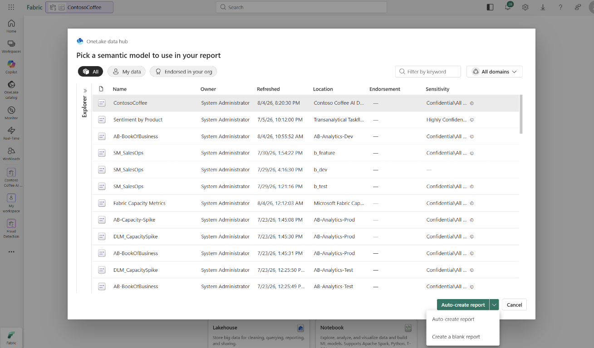
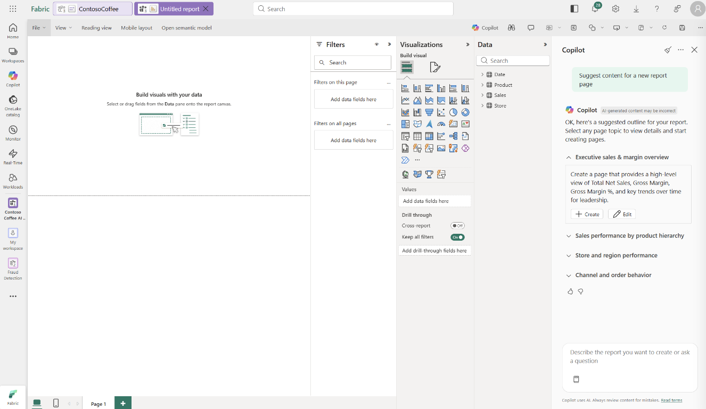
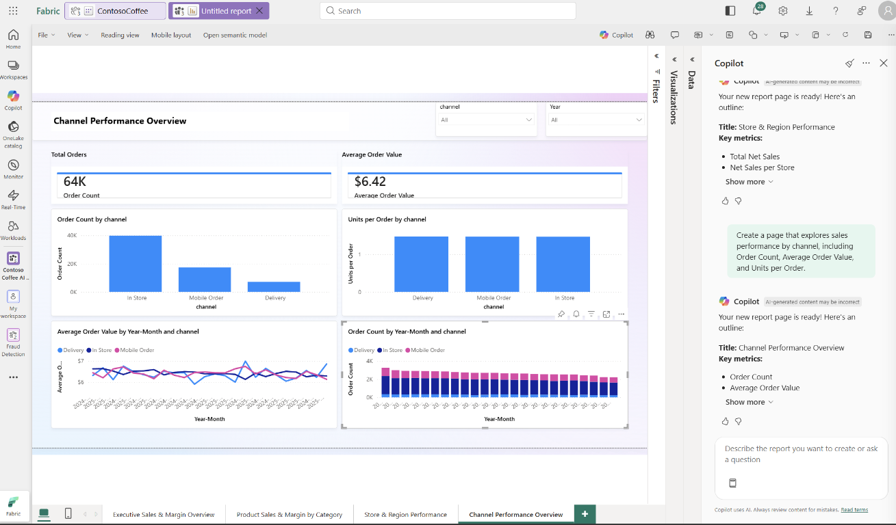
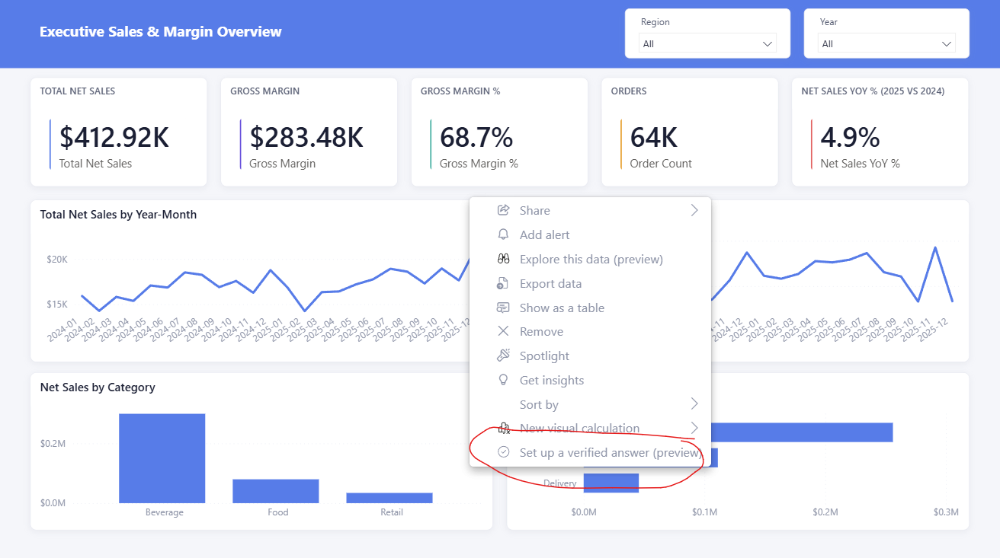
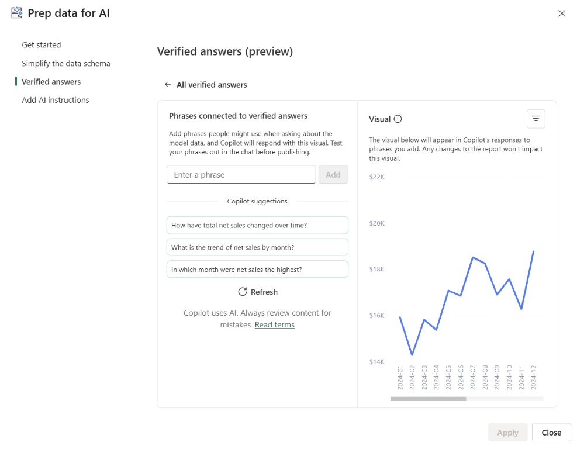

# Phase 5. Build the report with Copilot

**Agent:** `report-builder`
**Time:** 15 minutes
**AI on show:** Copilot in Power BI, report authoring, generally available

Copilot writes the first draft. You are the editor.

**Start here after phase 4**, with the `ContosoCoffee` model published, prepped for AI,
and pass B recorded in [`validation/scorecard.md`](../validation/scorecard.md).

---

## What Copilot can do for an author

Generally available, in Power BI Desktop and the Power BI service:

- Create a report page from a prompt
- Suggest content, which returns a proposed report outline you accept page by page
- Create a narrative or smart summary visual
- Summarise the semantic model, useful when you did not build it
- Write and explain DAX in DAX query view
- Generate measure descriptions in Model view

Prompts are capped at 10,000 characters.

If there is no Copilot button, go back to [phase 0](00-setup.md). It is almost always
capacity: trial capacities do not qualify.

---

## Start the report: auto-create or blank

In the Power BI service, select the `ContosoCoffee` semantic model, then use the arrow
beside `Auto-create report`. You have two starting points:

- **Auto-create report** generates an initial report immediately. Use it when speed
  matters more than seeing or shaping the outline first.
- **Create a blank report** opens an empty canvas. This is the better demo path because
  you can ask Copilot to inspect the model, propose several pages, and choose which ones
  it should build.



Choose `Create a blank report`, open the Copilot pane, and select
`Suggest content for a new report page` or use the first prompt below. Copilot evaluates
the semantic model and returns an outline. Expand each proposed page to review its
purpose, then select `Create` to generate it or `Edit` to refine the page prompt first.



Build the pages you want from the outline. Copilot creates the visuals and adds each page
as a report tab; the result is still a first draft that you must validate and edit.



---

## Four prompts, in this order

The value is in the contrast between them.

**1. Let it read the model.**

```text
Suggest content for this report.
```

Copilot proposes an outline based on your model. Accept one page. This shows it reading
your measures and dimensions, not guessing from the table names.

**2. The specific one.**

```text
Create a page showing total net sales and gross margin percent by region and by month,
with a card for total net sales and a bar chart of the top 5 products by net sales.
```

This should work well, because phase 3 gave every measure a description and phase 4 told
Copilot that sales and revenue both mean `Total Net Sales`.

**3. The vague one.**

```text
Create a page analysing channel mix over time.
```

Deliberately underspecified. Watch what it chooses. This is the prompt that justifies the
AI instructions from phase 4, and it is the one to run twice: once before phase 4 if you
can, once after.

**4. A narrative.**

```text
Add a narrative visual that summarises net sales performance for 2025 compared to 2024.
```

Read the output aloud. If it says something untrue, that is a phase 3 or 4 problem
surfacing, not a phase 5 problem.

---

## What it looks like when it is finished

This is the `Executive Sales & Margin Overview` page after the review pass below. Copilot
drafted the visuals and narrative, then the layout, theme and titles were tightened by
hand.


Worth pointing at during a demo:

| On the page | Why it is there |
| --- | --- |
| Cards read `Total Net Sales`, `Gross Margin`, `Gross Margin %`, `Order Count`, `Net Sales YoY %` | Measure names, straight from the model. Nothing is renamed in the report, so what the audience reads is what Copilot and the data agent read. |
| `$412,918.50` and `68.65%` | The same numbers `python validation/ground_truth.py` returns. Check them live if you want the room to trust the rest. |
| The YoY card is titled `NET SALES YOY % (2025 VS 2024)`, not just `NET SALES YOY %` | The title names the comparison because the card is filtered to one year. It has to be. See below. |
| Gross Margin % is its own chart, not a second series on the sales chart | A rate and an amount on one axis is the most common way a generated page misleads. |
| Category and Channel as separate bar charts | These are the two splits the audience always asks for next, so answering them before the question is asked keeps the demo moving. |
| The narrative visual summarises sales, orders, margin and monthly changes | It turns the validated measures into an executive-readable explanation, but its claims still need the same review as every generated visual. |
| Region and Year slicers in the header band | Every number on the page is qualified by a visible filter state. |

Two of the visuals on this page, `Total Net Sales by Year-Month` and `Net Sales by
Category`, are pinned as verified answers in [phase 4](04-prep-for-ai.md), along with
`Total Net Sales by Region` on the store page. That is why they are worth building
properly: a verified answer returns the visual itself rather than a freshly generated
query, so whatever you pin is what the audience sees.

### The bug this page used to have, and why it is worth demoing

That last card is the most useful thing on the page, because it was wrong.

When Copilot first generated it, it returned an inflated three-digit percentage. Net sales did not grow that much.

`Net Sales YoY %` is `DIVIDE([Total Net Sales] - [Net Sales PY], [Net Sales PY])`, and the
DAX is correct. The card was wrong because it had no year filter. With the whole model in
context, `Total Net Sales` covers 2024 and 2025 while `SAMEPERIODLASTYEAR` can only reach
back to 2024, so the card compared two years of sales against one. Filtered to 2025 the
same measure returns **4.90%**, which is what it shows above.

The fix was a visual-level filter pinning the card to 2025, plus the retitle so the
comparison is stated rather than assumed.

Two things worth saying out loud when you show this:

1. Copilot generated a card that was **plausible, well formatted, and wrong**. Nothing in
   the visual flagged it. Only checking the number against the data caught it.
2. Time intelligence at a grand total is the most common version of this failure. Any
   measure built on `SAMEPERIODLASTYEAR`, `DATEADD` or `TOTALYTD` needs a single period in
   context to mean anything, and a card with no filter does not have one.

If you want to reproduce it live, drop `Net Sales YoY %` on a blank card with no filter and
watch it return an inflated value.

This is also why phase 4 matters. The AI instructions tell Copilot and the data agent that
`Net Sales YoY %` needs a single year in context, so the same trap does not get reproduced
in a chat answer where there is no visual to inspect.

### The second bug: gross margin that reads as 100%

The `Store & Region Performance` page had a `Gross Margin % by City` bar chart where every
bar ran the full width of the plot, and a matrix whose `Gross Margin %` data bars were
solid across every row. It read as a 100% margin on every city, which nobody believes for
a coffee chain.

The DAX was fine. `Gross Margin %` returns **68.65%** and always did. Two separate things
made it *look* like 100%:

1. **The bar chart had no fixed value axis.** Gross margin sits in a 68.5% to 68.9% band
   across all eight cities, so Power BI auto-scaled the axis to end at the largest value
   and every bar filled the plot edge to edge. Pinning the axis to 0 and 1 is what any
   rate charted as bar length needs, and it made the bars stop at roughly two thirds.
2. **The matrix had data bars on a rate column.** A data bar encodes magnitude as length.
   On a column that barely varies it is full on every row regardless, so it carries no
   information and invites the 100% misread. The data bars were removed from
   `Gross Margin %` and kept on the amount columns, where length means something.

Fixing the axis made the chart honest but left it useless: eight near-identical bars.
That is worth understanding rather than hiding, because it is a property of the data and
not of the measure.

Gross margin rate in this dataset is **mathematically forced to be flat by city**. Every
product carries a fixed `unit_cost` and `unit_price`, so each product's margin rate is a
constant (81.25% on Herbal Tea down to 53.12% on Coffee Beans). The generator's
`PRODUCT_DEMAND` weights are global rather than per store, so all eight cities sell the
same mix within two percentage points, and a store's rate is just the sales-weighted
average of those constants. Predicting each city's rate from its mix alone reproduces the
actual rate to within a uniform 0.56%, which is the discount drag. Every other store-side
cut is flat for the same reason: store type spans 68.51% to 68.72%, channel 68.63% to
68.81%.

So the chart was repointed at `Gross Margin` in dollars, which varies about three to one
over the same cities, from $17,089 in Miami to $51,976 in New York. It stays on theme for
a store page and answers a question an executive actually asks. The 0 to 1 axis was
dropped along with it, because it is nonsense on a currency axis.

The rate still belongs on the page as a number, which is why the KPI card and the matrix
column keep it. A number reading 68.6% is honest. A bar of length 68.6% drawn next to
seven identical bars is not.

Where margin rate genuinely differs is by product, and the product page charts it there:
52.17% on Coffee Beans against 80.92% on Herbal Tea, and 52.17% to 72.06% by category.

The measure was hardened at the same time, for a different reason. Written as
`DIVIDE([Gross Margin], [Total Net Sales])` it returns exactly **1**, a perfect 100%
margin, in any filter context that has net sales but no cost of goods sold. A refresh that
drops `cost_amount`, an uncosted product, or a filter that excludes every costed row all
produce that answer silently. It now returns blank instead:

```dax
Gross Margin % =
VAR NetSales = [Total Net Sales]
VAR Cost = [Total Cost]
RETURN
    IF ( NOT ISBLANK ( Cost ), DIVIDE ( NetSales - Cost, NetSales ) )
```

Missing cost data now reads as missing. The totals are unchanged, because the demo data
has a cost on every row.

Worth saying out loud: only one of these was a calculation problem. A correct measure on
an auto-scaled axis is still a wrong answer to the person reading the page, and a correct
measure on a dimension that cannot vary is a wasted visual. Copilot will not set an axis
range for you, and it will not tell you that the dimension you picked has no signal in it.

---

## What you do next, every time

Copilot produced a draft. Before anyone sees it:

1. **Check every number** against `python validation/ground_truth.py`. A page that looks
   right and totals wrong is worse than no page at all.
2. **Fix the titles.** Copilot's titles are literal and usually too long.
3. **Check aggregations** on any numeric field that should not be summed.
4. **Set verified answers** on the best two or three visuals using the procedure at the
   end of this phase. Those visuals are now curated answers.
5. **Publish** to the workspace.
6. **Restyle it**, once the numbers are right, using the screenshot workflow below.

---

## Make it look like something, from a screenshot

Copilot in Power BI gave you a correct page that looks generic. Default visuals, stacked
in a column, stock theme. The Copilot pane cannot help you here, because it cannot read
an image.

GitHub Copilot Chat can read an image, and the Fabric MCP server (preview) can rewrite the
report definition. Together they can take a screenshot of the design someone actually
wants and apply it to the report you just built.

The repository skill
[`.github/skills/report-restyle-from-screenshot`](../.github/skills/report-restyle-from-screenshot/SKILL.md)
carries the procedure. The `report-builder` agent uses it automatically, or invoke it
with `/report-restyle-from-screenshot`.

**What you need first**

- The report published to the workspace. If it only exists in Desktop there is no item
  definition to fetch.
- A Fabric MCP server (preview) connected in VS Code, from [phase 1](01-provision.md).
- The numbers on the page already checked. Restyling first only makes a wrong page
  attractive.

**How it goes**

In GitHub Copilot Chat, with the `report-builder` agent selected, attach the screenshot
and say:

```text
Here is the layout I want. Restyle my Contoso Coffee report to match it.

Read the screenshot into a design spec first and show me the spec before you change
anything. Then fetch the report definition from the workspace with the Fabric MCP server
(preview), apply the layout, the palette, and the theme onto a new page called "Executive
overview", and leave the original Copilot page alone.

Do not change any field bindings or measures. Layout, visual types, and formatting only.
```

What happens under the hood:

1. Copilot reads the image and writes a design spec: canvas size, palette hex values,
   the KPI card row, chart positions, gutters. It shows you that spec first, because
   this is the step that goes wrong silently.
2. It calls `get_item_definition` and gets the report back as PBIR JSON: `page.json` per
   page, a `visual.json` per visual, `report.json` for the theme.
3. It rewrites the position blocks, the visual types where the screenshot clearly shows
   a different chart, the formatting, and it registers a custom theme built from your
   palette.
4. It calls `update_item_definition` with every required part, not only the changed
   ones, because that call replaces the definition rather than patching it.
5. It fetches the definition again, screenshots the result, and puts it next to your
   image so you can see what still does not match.

**The line that must not be crossed**

Layout, visual type, formatting, theme: fair game. Field bindings, measures, and the
semantic model binding: never. So re-run `python validation/ground_truth.py` afterwards.
A restyle that moves a number is a bug, not a design choice.

**Why demo it this way**

Keep the generic Copilot page and the restyled page side by side in the same report.
That contrast is the point: Copilot removes the blank page, and a screenshot plus MCP
turns the draft into something you would put in front of an executive, without anybody
dragging visuals around a canvas for an hour.

---

## The honest framing

Copilot is very good at the first 70 percent of a report and it does not know which 30
percent it got wrong. That is not a criticism, it is how to use it. It removes the blank
page and the fiddly layout work, and it hands you back something to review.

The demo lands better if you say that than if you pretend the output is finished.

---

## Set verified answers

Now that the report and its visuals exist, select the `Total Net Sales by Year-Month`
line chart, select `...`, then select `Set verified answer` in Desktop or
`Set up a verified answer` in the service.



In the service you also need to be in a Copilot enabled workspace, have authoring
permission on the semantic model, be on a report page, and be in edit mode.

Power BI opens `Prep data for AI` (preview) with the selected visual and suggests phrases based
on that visual. Review the suggestions before applying them. For this line chart, use
the three suggestions shown:

- `How have total net sales changed over time?`
- `What is the trend of net sales by month?`
- `In which month were net sales the highest?`



Keep the list short. Every verified answer is a promise you have to maintain when the
model changes.

---

## Verify this phase

Before you move on, run `python validation/ground_truth.py` and confirm the report shows
`$412,918.50`, `$283,482.20`, `68.65%`, and `4.90%` for the filtered 2025 YoY card. Publish
only after those numbers match.

---

Docs:
- https://learn.microsoft.com/power-bi/create-reports/copilot-introduction
- https://learn.microsoft.com/power-bi/create-reports/copilot-reports-overview
- https://learn.microsoft.com/power-bi/create-reports/copilot-enable-power-bi
- https://learn.microsoft.com/rest/api/fabric/articles/item-management/definitions/report-definition
- https://learn.microsoft.com/power-bi/developer/projects/projects-report

Next: [phase 6, insights](06-insights.md)
