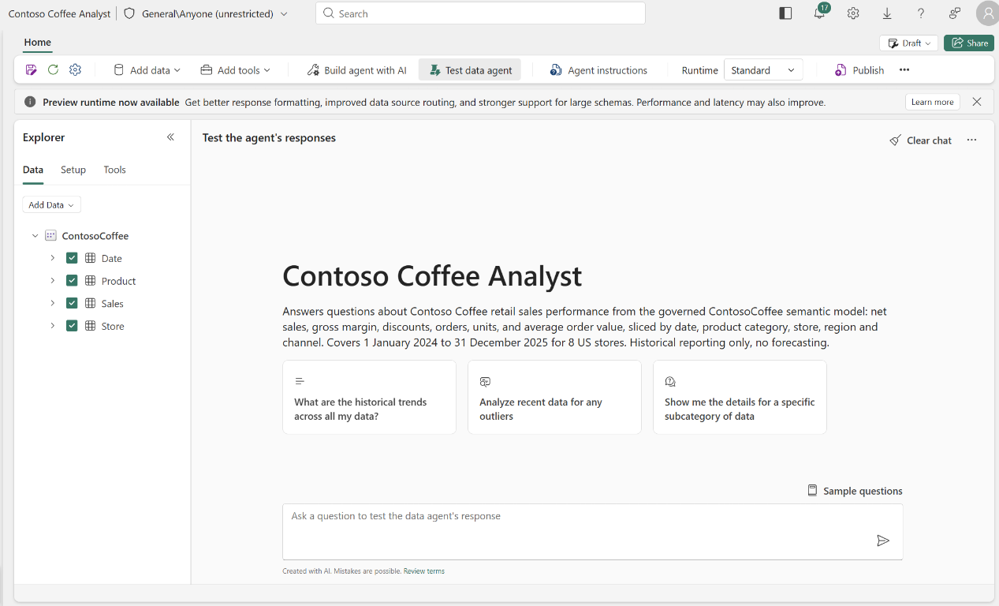

# Phase 7. Agents

**Agents:** `data-agent-builder`, then optionally `ontology-architect`
**Time:** 25 minutes, plus 20 minutes if you choose the optional ontology path
**AI on show:** Fabric data agent (GA), Fabric IQ ontology (preview)

Phases 5 and 6 put AI inside Power BI. This phase takes the same governed model and
serves it to anything that can hold a conversation.

---

## Part A. Fabric data agent

A [Fabric data agent](https://learn.microsoft.com/fabric/data-science/concept-data-agent)
is a conversational analyst scoped to data you choose. It is generally available.

### Prerequisites

- Paid F2 or higher Fabric capacity, or P1 or higher with Fabric enabled
- Tenant settings, under Copilot and Azure OpenAI:
  - `Users can use Copilot and other features powered by Azure OpenAI`
  - The cross-geo processing and cross-geo storing settings, if your capacity is outside
    the EU data boundary and the US
- Read access to every source you add
- To use the agent from standalone Copilot in Power BI (preview), the standalone Copilot
  tenant setting is enabled
- Phase 4 finished. Prep data for AI (preview) is not optional here, it is the thing that
  makes the agent accurate. See "why the instruction box is not where the work happens" below.

### One source, on purpose

This agent gets **one** data source: the `ContosoCoffee` semantic model.

Not the lakehouse. The lakehouse holds the same numbers in raw, ungoverned form. Adding
it gives the orchestrator a second way to answer "what was revenue in 2025", one that
bypasses every measure, description and business rule built in phases 3 and 4. You would
then spend the demo writing routing instructions to talk the agent out of using a source
you chose to give it.

An agent supports up to five sources. Use fewer. Fewer sources means less ambiguity,
better routing, and lower latency.

### Build it

1. In the workspace, `+ New item`, search `Fabric data agent`, select it.
2. Name it `Contoso Coffee Analyst`.
3. The OneLake catalog opens. Add one source: the `ContosoCoffee` semantic model, then
   **stop**. Do not also add `LH_ContosoCoffee`. The catalog will happily show it to you
   and it is the wrong choice for the reason above.
4. In the Explorer pane, tick the tables the agent may use: `Date`, `Sales`, `Product`,
   `Store`. Select the **same tables you chose in the phase 4 AI data schema**. If the two
   disagree, the agent and the Copilot pane will answer differently and you will not know
   which to trust.
5. `Data agent instructions`. The text to paste is in
   [`.github/prompts/README.md`](../.github/prompts/README.md), phase 7. Read the note
   below first so you understand what this box does and does not do.
6. `Example queries`. **Not available.** Semantic model sources do not support example
   query pairs, data source instructions, or data source descriptions. Verified answers in
   Prep data for AI (preview) are the equivalent, which is another reason phase 4 comes first.
7. Test in the chat canvas. Expand the generated DAX on each answer and check it before
   you believe the number.
8. `Publish`. Write a real description. It becomes the MCP tool description and the
   Microsoft 365 Copilot description, so it is how other systems decide to call your
   agent.



### Why the instruction box is not where the work happens

This is the single most useful thing to say out loud in this phase.

**Agent-level instructions are not passed to the DAX generation step.** For a semantic
model source, the DAX generation tool reads only the model metadata and the Prep data for
AI (preview) configuration. Anything you write in the agent instruction box about which measure
means what is ignored when the query is built.

So the two boxes have different jobs:

| Put it here | What belongs there |
| --- | --- |
| Prep data for AI (preview), on the model | Business definitions, terminology, which measure to use, closed value lists, refusal rules. Everything that changes the DAX. |
| Data agent instructions | Objective, scope, tone, response formatting, abbreviations, and how to handle out-of-scope questions. Everything that shapes the reply after the DAX has run. |

Repeating your business definitions in the agent box feels productive and does nothing.
Phase 4 is doing the work.

The other thing that surprises people: for a semantic model source, only **Read**
permission is required. Build permission is not needed for agent-driven queries.

### How it answers

The agent picks a source, then generates a query with the matching translator. With a
single semantic model source, that is always NL2DAX over the XMLA endpoint:

| Source | Translator |
| --- | --- |
| Power BI semantic model | NL2DAX, over the XMLA endpoint |
| Lakehouse or warehouse | NL2SQL |
| KQL database | NL2KQL |

It validates the query, executes it **read only** under the calling user's permissions,
and formats the result.

Beyond Prep data for AI (preview), the DAX generation tool also reads **report visual metadata**: visual
titles, the columns and measures each visual uses, and the filters applied. The report
built in phase 5 is therefore part of the grounding, which is why its visuals have
descriptive titles rather than the Copilot defaults.

### Consuming it

In-product chat is GA. Consuming a Fabric data agent from outside Fabric is preview.
Every path in the table below uses a preview experience, so check it against Microsoft
Learn before you demo it:

| Path | How |
| --- | --- |
| Standalone Copilot in Power BI (preview) | Copilot pane, `Add items for better results`, `Data agents` |
| MCP endpoint (preview) | `https://api.fabric.microsoft.com/v1/mcp/workspaces/{workspaceId}/dataagents/{dataAgentId}/agent`, scope `https://api.fabric.microsoft.com/.default` |
| Microsoft Foundry (preview) | `Add`, `Knowledge`, `Microsoft Fabric`, then `FabricTool` in `azure-ai-projects` |
| Copilot Studio (preview) | `Agents`, `Add`, `Microsoft Fabric`, validated for the Teams channel |
| Microsoft 365 Copilot (preview) | `Publish to Agent Store`, then `@` mention it |

Data agent responses are capped at 25 rows and 25 columns. Some responses are not
returned through the SDK, Microsoft 365 Copilot, Teams, or Foundry. Check the limitations
section of the concepts page for the current list.

For new code, prefer the MCP endpoint. The older Python client path builds on the OpenAI
Assistants API, which has an announced shutdown date of 26 August 2026.

### Use it as a business user

An agent that only ever gets asked the question bank is a test harness, not a product.
Once it answers correctly, show what it is actually for.

**When to reach for the agent instead of the report Copilot pane.**

| | Copilot pane | Data agent |
| --- | --- | --- |
| Grounding | Semantic model plus the open report | Semantic model, plus report visual metadata |
| Verified answers | Returns the pinned visual | Informs the answer, but the reply is data and prose |
| Output | Visuals and prose | Text and tables, capped at 25 rows and 25 columns |
| Multi-part questions | Weaker | Stronger, it is built for them |
| Reuse | Inside Power BI | Teams, Microsoft 365 Copilot, Foundry, Copilot Studio, MCP |

**The first prompt to run against any new agent.**

```text
You have access to the Contoso Coffee sales model. Describe what you can and cannot answer,
list the measures and dimensions available to you, and give me the ten highest-value
questions a retail leadership team should be asking you. Do not answer them yet.
```

If it describes its own scope vaguely, so does your publish description, and every
downstream system that reads that description will route to it badly.

**Where the agent earns its place, multi-part questions.**

```text
For 2025, give me a table of net sales, gross margin and gross margin percent by region. Add
net sales per store as a fourth column, and tell me which region looks strongest on each of
the two views.
```

```text
Identify the three months in 2025 with the largest month over month decline in net sales.
For each month, break the decline down by category and name the largest contributor.
```

The report Copilot pane will struggle with both. That difference is the argument for
building the agent.

**Where it lands, once published.** In Microsoft 365 Copilot or Teams (preview), `@` mention
it in the conversation where the decision is being made:

```text
@Contoso Coffee Analyst what were net sales and gross margin percent in 2025, and how did
that compare with 2024?
```

The answer arrives in the meeting rather than in a tab somebody has to remember to open.

**Prerequisites specific to the agent**, on top of everything in phases 3 and 4, since the
agent inherits every model weakness and fixes none of them:

- One data source, the `ContosoCoffee` semantic model. Adding the lakehouse gives the
  orchestrator an ungoverned route to the same numbers.
- The tables ticked in the agent Explorer match the phase 4 AI data schema. If they differ,
  the agent and the Copilot pane will disagree and neither will be wrong.
- A real publish description. It becomes the tool description that Microsoft 365 Copilot and
  MCP clients read when deciding whether to call your agent.

Persona prompt sets, expected values, refusal prompts and consumption prompts are in the
[business prompt library](../.github/prompts/business-prompt-library.md), section 8.

### Verify

Ask the same 15 questions. Record them as pass D. Two AI surfaces over one governed model
is a far more interesting comparison than either alone, and because both read the same
Prep data for AI (preview) configuration, a disagreement between them is a real finding rather than
noise.

For each answer, expand the generated DAX. If a number is wrong, the fix is almost always
in one of four places, in this order: the model itself, the AI data schema, the verified
answers, then the AI instructions. It is very rarely the agent instruction box.

Stop here for the standard demo. You have built the GA data agent and recorded pass D.
Continue to Part B only if Fabric IQ ontology (preview) is enabled and you want the
optional pass E comparison.

Docs:
- https://learn.microsoft.com/fabric/data-science/concept-data-agent
- https://learn.microsoft.com/fabric/data-science/how-to-create-data-agent
- https://learn.microsoft.com/fabric/data-science/data-agent-tenant-settings
- https://learn.microsoft.com/fabric/data-science/semantic-model-best-practices
- https://learn.microsoft.com/fabric/data-science/data-agent-configurations
- https://learn.microsoft.com/fabric/data-science/data-agent-semantic-model

---

## Part B. Fabric IQ ontology, optional (preview)

Skip this if Fabric IQ ontology (preview) is not enabled on your tenant. The demo is
complete without it.

### What to say first

[Fabric IQ](https://learn.microsoft.com/fabric/iq/overview) (preview) is the business
context layer, alongside Work IQ, Foundry IQ, and Web IQ in Microsoft IQ. It has three
layers: unified data in OneLake, business intelligence in Power BI semantic models, and
operational intelligence in the ontology item.

The point for this demo: a semantic model answers "what is revenue by region". An
ontology answers "what is a Store, what is a Product, and how do they connect", once,
for every agent and every workload, instead of once per report.

| Concept | Plain meaning | Contoso Coffee |
| --- | --- | --- |
| Entity type | The reusable definition of a real world thing | `Store`, `Product`, `Sales` |
| Entity instance | One concrete occurrence | The Midtown store |
| Property | A named fact with a type | `Store.Region` |
| Relationship type | A typed, directional link with cardinality | `Sales_has_Store` |
| Data binding | Link from an entity type to a real OneLake table | `Store` bound to `dim_store` |
| Contextualization | Link from a *relationship* to the table that joins both sides | `Sales_has_Store` bound to `fact_sales` |
| Ontology graph | The queryable instance graph | Store to Sales to Product paths |

A relationship type without a contextualization is declared but not bound. It looks
correct in the portal and returns nothing. That is the easiest defect here to miss.

Ontology also has **NL2Ontology**, which turns a business question into a structured
query across the bound sources.

### Prerequisites

A Fabric administrator enables, in tenant settings:

- `Enable Ontology item (preview)`
- `Users can use Copilot and other features powered by Azure OpenAI`
- `Data sent to Azure OpenAI can be processed outside your capacity's geographic region,
  compliance boundary, or national cloud instance`

### Generate it from the semantic model

This is the fast path, and it is the one worth showing, because it proves the phase 3
work was not throwaway.

1. Open the `ContosoCoffee` semantic model in Fabric, or its overview page.
2. Select `Generate Ontology` on the ribbon.
3. Pick the workspace, name it `ContosoCoffee`. Letters, numbers and underscores
   only. No spaces, no dashes.
4. Select `Create`.

If no entity types appear: the model is not published, its tables are hidden, or its
relationships are missing. All three are phase 3 problems.

### Then clean it up

Generated entity types are named after the **model** tables, so you get `Sales`, `Store`,
`Product` and `Date`. Because phase 3 already renamed everything to business names, this
is now a light touch rather than a rescue.

That is the lesson, and it is a better one than it looks. Had the model still carried
`fact_sales` and `dim_store`, those names would have propagated straight into the
ontology and from there into every agent that consumes it. Naming debt compounds
downstream. The ontology is where table names would otherwise leak into the business.

### Then audit it, because the generator got it wrong

Names are the easy part. In this repo the generated ontology was **structurally broken**
and it still looked correct in the portal. Run this audit before you demo it:

| Check | Failure we actually hit |
| --- | --- |
| Do the bound columns exist? | Every binding used the semantic model **display name** against the **physical** lakehouse table. `dim_product` was bound to `Product Name`, `List Price`, `Cost per Unit`. The real columns are `product_name`, `unit_price`, `unit_cost`. |
| Does every entity have a key? | `entityIdParts` was empty on all four. |
| Does every entity have a display name? | `displayNamePropertyId` was null on all four. |
| Is every relationship bound? | No relationship had a `Contextualizations/` part, so none of the three joins resolved. |
| Are the properties real columns? | `Sales` carried 23 properties, of which 21 were DAX **measure** names. Measures are not columns. The five real fact columns were missing. |

Any one of those returns an empty graph. Together they mean the item could never have
produced a single instance. The portal shows no error for any of them.

The cause is that the generator reads names from the **semantic model** and binds to the
**physical** table. Those are two different layers, and phase 2 never renamed the lakehouse
columns, so nothing lined up.

### Repair it through the API

The portal can fix names, but keys, bindings and contextualizations are faster to repair
through `getDefinition` and `updateDefinition`. Hand the job to the
[`ontology-architect`](../.github/agents/ontology-architect.agent.md) agent and keep the
workflow short:

1. Fetch and decode the definition. If `getDefinition` returns `403 ItemHasProtectedLabel`,
   stop rather than writing blind.
2. Save a rollback backup and report the part count.
3. Read the real physical column names from OneLake or the lakehouse SQL endpoint, not from
   the semantic model display names.
4. Report the defects, propose a change set, and get approval before writing.
5. After `updateDefinition`, read the definition back and prove no parts were dropped.

Two limits are worth knowing before you start:

- **`entityIdParts` rejects `DateTime`.** Keys must be `String` or `BigInt`. A date
  dimension whose only unique column is a date needs a new `String` property bound to that
  same column.
- **There is no refresh API.** `POST /jobs/instances?jobType=Refresh` returns
  `InvalidJobType` for `GraphModel` in Fabric IQ ontology (preview), so refresh the graph
  model from the portal once the repair lands. Until you do, instances will not appear and the repair will look
  like it failed.

### Entity descriptions

The ontology schema has **no description field and no synonym field**, on entity types or
on properties. Do not go looking for one; a payload carrying it fails validation. The only
writable text surfaces are the item description, capped at 256 characters, and a
per-entity `Documents/{name}.json` part that holds `displayText` plus a required `url`.

So the authoritative descriptions live here, and the short form is mirrored into each
entity's `Documents` part so it is visible in Fabric:

| Entity | Description |
| --- | --- |
| `Sales` | Sales fact. One row per sales order line, 64,335 rows across 2024 and 2025. `net_amount` is revenue after discount, `gross_amount` is before discount, `cost_amount` is cost of goods sold. Gross margin is `net_amount` minus `cost_amount`. There is no customer dimension and no returns. |
| `Product` | Product catalog. 12 SKUs across the beverage, food and retail categories. `unit_price` is the retail price and `unit_cost` is the unit cost. `category` and `subcategory` form the product hierarchy. |
| `Store` | Retail location. 8 stores. `region`, `state` and `city` form the geography hierarchy, `store_type` separates formats, and `opened_date` is the launch date. |
| `Date` | Calendar dimension. One row per day for 731 days covering 2024 and 2025. Use it for every time-based grouping and filter. `date_key` is the entity key and joins to `Sales`. |

Column names above are the physical lakehouse column names, in snake_case. Ontology
bindings resolve against the lakehouse tables, not against the semantic model display
names such as `Net Amount`. Using the display name here is exactly the mistake that
produced an ontology with no instances.

Keep this table in step with `semantic-model/ai-instructions.md`. The two describe the same
business, and an agent reading both should not find a contradiction.

### Use it

Add the ontology as a second source to `Contoso Coffee Analyst`, then ask a
relationship-shaped question and compare against the pure semantic model answer. This is
the one deliberate exception to the single-source rule stated at the top of this page: the
ontology earns its place because it answers a different shape of question rather than
duplicating the first. The lakehouse still stays out. Ontology sources support agent
instructions and a data source description, but not schema selection, data source
instructions, or example queries.

### Verify optional pass E

Ask the same 15 questions again with the ontology source added, then record pass E in the
scorecard. If the answer is the same as pass D, the ontology did not add value for that
question. If it differs, expand the query details and decide whether the graph improved
the answer or introduced another source of ambiguity.

Docs:
- https://learn.microsoft.com/fabric/iq/overview
- https://learn.microsoft.com/fabric/iq/ontology/overview
- https://learn.microsoft.com/fabric/iq/ontology/tutorial-0-introduction
- https://learn.microsoft.com/fabric/iq/ontology/tutorial-1-create-ontology
- https://learn.microsoft.com/fabric/iq/ontology/overview-tenant-settings

Next: [phase 8, validate](08-validate.md)
