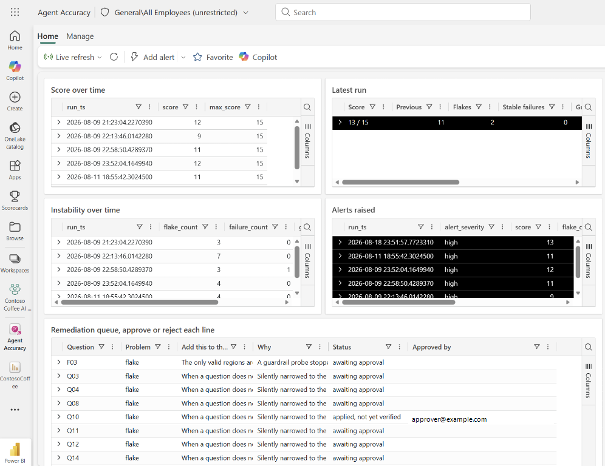

# Phase 8. Validate

**Agent:** `accuracy-validator`
**Time:** 15 minutes per pass
**AI on show:** none. This phase is the human check on everything above it.

Most AI demos end at phase 6 with a nice chart and no evidence. This phase is why this
one is different.

---

## The loop

```
ask the 15 questions  ->  score against ground truth  ->  find the failures
        ^                                                       |
        |                                                       v
   re-ask the same 15  <-  fix the model, not the prompt  <------+
```

Three rules:

1. **Ask the questions exactly as written.** Rewording a question until it works is not a
   fix, it is hiding a failure.
2. **Fix the model, not the prompt.** The fix belongs in a description, a summarisation
   setting, a name, an AI instruction, or a verified answer.
3. **A verified answer is a patch, not a fix.** It solves one phrasing. Log it as a patch
   so nobody mistakes it for a model improvement.

---

## Get the ground truth

```powershell
python validation/ground_truth.py
```

This reads the CSVs in `data/` and prints the correct answer for all 15 questions. It is
the only source of expected values in this repo. Never type a number in from memory.

Because `data/generate_data.py` is seeded, these numbers are the same for everyone who
runs the demo.

---

## Run a pass

1. Open [`validation/question-bank.md`](../validation/question-bank.md).
2. Ask Q01 to Q15, in order, in one surface. These are the only questions that count
   toward the `/ 15` score.
3. Grade each answer: **Correct**, **Partly correct**, **Wrong**, **Refused**.
   - Partly correct means the number is right but the framing is wrong, or the right
     ranking with a wrong value.
   - Refused counts as a failure for Q01 to Q15, because the model should be able to
     answer them.
4. Record the result in [`validation/scorecard.md`](../validation/scorecard.md).
5. Ask F01 to F03 and record how they behaved in the scorecard's failure questions table.
   They do not change the `/ 15` score. For those probes, refusal or clarification can be
   the correct behaviour.

Five passes are defined:

| Pass | Surface | Run after |
| --- | --- | --- |
| A | Copilot pane, before Prep data for AI (preview) | phase 3b |
| B | Copilot pane, after Prep data for AI (preview) | phase 4 |
| C | Standalone Copilot (preview) | phase 6 |
| D | Fabric data agent | phase 7 |
| E | Data agent plus ontology (preview, optional) | phase 7 |

Score each pass as the count of **Correct** answers across Q01 to Q15. Partly correct,
Wrong, and Refused all count as misses for the score, then belong in the failure log.

**B minus A is the headline.** It is the only number in this demo that measures the value
of the modelling work rather than the value of the product.

Pass A also settles the [phase 3b](03b-readiness-audit.md) audit. Every finding you
recorded there came with a predicted failure attached. Go back and mark which
predictions pass A confirmed. A confirmed prediction is the strongest evidence this demo
produces, because it shows the failure was visible in the metadata before anyone asked
the AI anything.

---

## Diagnose a failure

For every answer that was not Correct, expand **How Copilot arrived at this** and read
the fields, measures, and filters it used. Then find the cause in this table.

| Symptom | Usual cause | Fix |
| --- | --- | --- |
| A total that is a few percent too high | It used `Gross Sales`, not `Total Net Sales` | AI instruction defining the default sales measure |
| A year total of 4,050 | `year` is set to Sum | Set `year` to Don't summarize |
| Confident answer about a region that does not exist | No constraint on region values | AI instruction listing the three regions |
| A forecast | No statement that the model is historical | AI instruction saying there is no forecast |
| Picks the wrong column with a similar name | Two columns, no descriptions | Add descriptions, or exclude one via the AI data schema |
| Correct number, useless wording | Nothing wrong with the model | Verified answer, and log it as a patch |
| Ignores a measure entirely | Not in the AI data schema | Include it |
| Uses the wrong table's `Date` column | Duplicate visible column names across tables | Rename or hide one, or exclude it from the AI data schema |
| Never uses `YTD` or `PY` | Calculation items are not in model metadata | List and explain the items in the calculation group column description |
| Cannot find a number that exists in a report | It is a report-scoped measure | Move it into the semantic model |
| Description is there but ignored | The meaning starts after character 200 | Rewrite so the meaning comes first |

Rows 8 to 11 are the ones that come out of the
[readiness checklist](../semantic-model/ai-readiness-checklist.md). If you ran
[phase 3b](03b-readiness-audit.md) properly, you already predicted them.

Log every one of these in the failure log table in the scorecard, with the cause named as
a piece of metadata, not as "Copilot got it wrong".

---

## Then re-run

Re-run the whole bank, not just the questions that failed. Fixing one description can
change an unrelated answer, and you want to know about that before your audience does.

Note that AI is nondeterministic. If a single answer changes between two runs with no
model change in between, that is expected. Judge the number, not the sentence, and if a
result surprises you, run it again before concluding anything.

---

## Running it automatically

Everything above is the manual pass, and it is still the right thing to do the first time
because watching the answers is how you learn what the model is doing.

The repo also automates it, end to end.
[`validation/automation-spec.md`](../validation/automation-spec.md) covers the design; the
short version is:

1. A Fabric notebook asks every question three times and grades against ground truth.
2. Results go to Delta, and a summary goes to an eventhouse.
3. An Activator rule emails an alert when a run regresses, and a second rule emails a
   digest whenever a run leaves defects nobody has approved or rejected yet.
4. A real-time dashboard shows the failures next to the exact sentence that would fix each
   one. It is read only: it is where you decide, not where you act.
5. A human approves one sentence, from whichever surface suits them: a button in the
   report, an Adaptive Card in Outlook, or
   `python validation/approve.py --question Q10 --by you@example.com`. All three write the
   same row.
6. A third Activator rule runs the remediation notebook, which appends that sentence to
   the model AI instructions and proves the write landed.
7. The next evaluation run says whether it actually worked.

Only step 5 is a person, and only step 5 changes the model.



[`validation/approval-by-email.md`](../validation/approval-by-email.md) compares the three
surfaces. The report button is the one worth building, because it is the only one where
the approver's identity is read from their token rather than typed into a field.

Three things it caught immediately that the manual pass cannot:

- **Nondeterminism.** Six of the eighteen questions answered correctly on some attempts
  and not others. A manual pass asks each question once, so it would have scored the same
  model 14 or 15 out of 15. A question that is right three times in five is worse in front
  of an audience than one that is consistently wrong, because you cannot brief around it.
- **Silent time narrowing.** Q10, Q11 and Q12 carry no time filter, and the agent
  sometimes answered for the most recent period only. The numbers looked plausible and
  were roughly a tenth of the truth.
- **A fix that only half worked.** The approved instruction took the score from 9 to 11
  and fixed the guardrails, and Q10 got worse. The loop knows that only because it
  re-measured.

Run the tests for the grading logic with:

```bash
python -m unittest discover -s validation -p "test_*.py"
```

Three rules from that spec are worth knowing even if you never run it:

- **Repeat every question.** One sample cannot distinguish wrong from ambiguous.
- **The fix goes in the model, not the agent.** Agent instructions are not passed to the
  DAX generation step, so a fix written there looks like a change and does nothing.
- **Never let automation write verified answers.** A loop optimising a `/ 15` score will
  pin its way to 15/15 over a model that is still wrong. A verified answer is a patch, not
  a fix, and that rule has to hold hardest when a machine is applying it.

---

## Reading the loop from Power BI

The loop's state lives in a SQL database in Fabric, and a Direct Lake semantic
model called `AgentEvals` sits over it, so the accuracy story can be read in a
report rather than in a KQL dashboard — and asked of Copilot.

Fabric generates that model for you, and what it generates is a copy of the
database: `runs`, `answers`, snake_case columns, no relationships, no
measures, and every integer set to sum. That last one matters more than it
looks. A run scores 13 out of 15. Summed across ten runs it is 130 out of 15,
which is not a wrong answer so much as a meaningless one, and it looks
entirely reasonable on a card.

So the model gets the same treatment as the Contoso Coffee model in phase 3,
from a spec rather than by hand:

```bash
python validation/build_agentevals_model.py --apply
```

That renames the tables to what people say out loud, hides all 32 keys and raw
counts, describes every remaining table, column and measure, wires the nine
relationships Fabric did not create, and adds
[40 measures](../semantic-model/agentevals/measures.dax) — then reframes the
model and evaluates every measure, naming any that fail.

The last part is not decoration. Fabric accepts a measure whose DAX does not
compile, leaves it in an error state and says nothing, so it is invisible
until somebody drops it on a visual. Two got through the first deployment of
this file: a variable called `Current`, which is a reserved word, and a table
variable used as if it were a table.

The AI instructions, AI data schema and verified answers for it are in
[`semantic-model/agentevals/ai-instructions.md`](../semantic-model/agentevals/ai-instructions.md).
The important instruction is the one about summing: *scores belong to a single
run and must never be added together.* The model that measures AI accuracy has
to survive being asked about by AI.

### Closing the loop in the report

The report over that model is a translytical task flow, built the same way:

```bash
python validation/build_agentevals_report.py --apply
```

Three pages. **Agent Answer Quality** is the evidence: score, the split of
grades, every question with the answer it got, and the sentence the harness
proposes as a fix. **Review & Approve Fixes** is the decision: the queue, an
input slicer for the decision and one for the note, and a button bound to the
`approve_remediation` user data function, which writes the row to
`dbo.approvals`. **Same Fix, Several Questions** is the same decision made
once for a group.

It is deliberately the same shape as the product-reviews translytical demo,
because the shapes are the same: a question is the product, an answer is the
review, the harness's proposed instruction is the agent comment, and the
approval is the employee comment written back.

With one difference. In that demo the employee comment is the outcome. Here
approving only records a decision — the notebook applies it and the next run
proves it worked — so the page counts *approved*, *awaiting apply* and
*verified* separately and says why. A report that collapsed them would claim a
fix nobody has written.

### What happens after you approve, by kind of fix

There are three paths, and **you do not choose between them**. `route_defect`
in `eval_harness.py` decides at evaluation time, from the evidence, and
records the answer on the defect as a **tier** and an **instruction target**.
The queue shows both.

| Tier | What it means | Who acts |
| --- | --- | --- |
| 0 | The agent errored on every attempt. Nothing was learned about the model | Re-run. No model change |
| 1 | Additive metadata. The harness can propose the exact sentence | You approve, the notebook applies it |
| 2 | It changes a number or needs judgement | A person edits the model |
| 3 | Wording, or a verified answer | A person, never automated |

**Tier 1, target `semantic_model`.** The instruction goes into the model's own
AI instructions, and this is the common case: only a model instruction can
change what DAX gets generated. `agent_remediate` does this itself — no
handoff, no SDK, no `%pip install`. It reads the model over XMLA with sempy,
backs up the whole TMSL first, re-reads immediately before writing to catch a
concurrent change, writes `CustomInstructions`, and then checks the
server-side `lastUpdate` actually moved. A content read-back alone is not
evidence, because the session can serve you your own copy.

**Tier 1, target `data_agent`.** Same button, same approval, same notebook.
`agent_remediate` splits the approvals by target, does the model ones itself,
and hands the agent ones to `agent_remediate_agent` as a reference run, which
patches staging and then publishes. It is separate only because it installs
the data agent SDK at run time.

So for both tier 1 targets the process you already used is the whole process.
Approve, wait about two minutes, re-run `agent_eval`.

**Tier 2 is not approvable at all, and that is the point.** There is no button
for it. `auto_appliable` is false, and the approval function refuses:

> Q07 is tier 2 and has no automatically appliable fix. It needs a person in
> the model. Reject it, or fix it by hand.

An AI instruction is metadata. It can tell the model how to choose among
things that already exist; it cannot change what a number means. A measure
change does change what a number means, so the loop is never allowed to make
one. Letting it would mean an evaluation loop editing the thing it is scoring.

The tier 2 path is:

```bash
python validation/file_issues.py --dry-run   # see what it would file
python validation/file_issues.py             # file them
python validation/file_issues.py --question Q10
```

That opens a GitHub issue per defect carrying the grades across every attempt,
the answers the agent actually gave, and the expected value — evidence to
start from rather than "the agent seems wrong sometimes". You then edit the
measure, the description or the model in Power BI, by hand, and the next
`agent_eval` run is what says whether it worked. It is deliberately not
scheduled: a loop that opens issues on a timer produces a backlog nobody
reads.

**Tier 1 can become tier 2 on its own.** If the sentence a defect would
propose is already in the model and the question is still failing, adding it
again would change nothing, so `propose_fixes` escalates it instead of
offering it a second time. You will see it in the queue as
*"already instructed, needs a different kind of fix"*. Without that, the loop
has a stuck state that looks like progress: propose, approve, merge
idempotently, nothing changes, repeat forever.

### When the same fix is proposed five times

The harness proposes from a small library of sentences, so one wrong behaviour
usually shows up as the same instruction against four or five questions at
once. Approving them one at a time is five clicks that all mean the same
thing.

Approve one on **Review & Approve Fixes**. The reply names the others:

> Approved Q11 as you@contoso.com. […] 3 other question(s) are waiting on this
> exact sentence: Q12, Q14, Q15.

Then go to **Same Fix, Several Questions**, read the group, and submit once.
`approve_similar` records a real decision against each of them and marks them
covered by the approval that carries the change, so the sentence is written to
the model or the agent **once** rather than four times. Not approving them is
a valid answer; they stay in the queue.

The report keeps the two apart on purpose. `Instructions Written` counts
remediations that changed something. `Already Present` counts approvals that
needed no write, either because the group is covered or because the sentence
was already there. The loop declining to write the same line twice is not the
same as the loop being stuck, and a single "applied" count would hide the
difference.

[`semantic-model/agentevals/report.md`](../semantic-model/agentevals/report.md)
covers the layout and the one manual step, binding the two buttons to their
functions.

### If an approved agent instruction does not appear in the agent

Check four things, in this order.

**Is the mirror running?** Nothing is applied at all if it is not. See above.
This is the first thing to rule out, because it produces no error anywhere.

**Does `agent_remediate_agent` exist in the workspace?** The handoff resolves
it by display name and swallows the failure, so a missing notebook looks
exactly like a working one.

**Are you looking at the right place?** An instruction targeted at
`semantic_model` goes into the **ContosoCoffee semantic model's** AI
instructions, under `## Automated remediation`, not into the data agent. Most
proposals are model-targeted, because only a model instruction can change a
number. The queue shows `Target` for exactly this reason.

**Is it published?** A data agent has a staging configuration and a published
one. The write PATCHes staging, and nothing queries staging. The agent that
answers questions only changes when something publishes that draft. The
remediation notebook does that now and refuses to record anything as applied
until it can read the sentence back from the published configuration.

**Did the Spark session die before the notebook ran?** `agent_remediate_agent`
used to `%pip install fabric-data-agent-sdk`. That cancelled its session in
ten seconds with `System_Cancelled_Session_Statements_Failed`, before a line
of its own code ran, so there was no output to read and the handoff caught the
failure quietly. If you see that error code on this notebook, something has
reintroduced an install: the notebook now uses plain REST and needs nothing
the Spark runtime does not already ship.

### Running agent_remediate by hand

It refuses without `APPROVED_BY`:

> APPROVED_BY is required. A governed semantic model does not take anonymous
> changes, so this refuses rather than guessing who you are.

That is the guard, not a fault. Activator passes the value when it fires;
running the notebook yourself, set it in the parameters cell to your own
sign-in. `DRY_RUN` is `True` by default and prints the diff without writing,
so set it to `False` once you have read the diff.

Both parameters are deliberately empty in source control, which is why a
freshly imported notebook always needs them filled in.

If a fix still does not appear, open `agent_remediate` and read the end of its
output. A failed handoff to `agent_remediate_agent` does not fail that run,
because the semantic model work has already landed, but it prints a banner
saying nothing reached the data agent. The approvals stay open, so fixing the
cause and re-running is all that is needed.

### If a page or a measure is in this repo but not in your report

Because nothing here deploys itself, and the report is the one artifact this
repo does not keep a copy of.

`semantic-model/agentevals/` holds `measures.dax`, `report.md` and the AI
instructions — documentation of the report, not the report. The definition
exists only in your workspace, and it changes only when
`build_agentevals_report.py --apply` runs. Pulling this repo changes what
*would* be built, and nothing else.

Redeploy in dependency order. Each step reads something the step before it
creates, so running them backwards gives you a page of broken visuals rather
than an error:

```bash
python validation/apply_schema.py                     # tables, columns, views
python validation/build_approval_function.py --deploy  # the writeback functions
python validation/build_agentevals_model.py --apply    # columns and measures
python validation/build_agentevals_report.py --apply   # pages and visuals
```

`apply_schema.py --check` verifies without changing anything, and it derives
what it expects from `build_sql_schema.py`, so it names any table, column or
view your database is missing. It also selects from every view, because
`CREATE VIEW` succeeds against columns that do not exist and a view can be
present and broken.

Existing button bindings survive the report rebuild — the builder reads the
deployed report first and carries every bound button across, printing
`kept the existing data function binding (...)` once per button. A **new**
button arrives unbound, because a binding names a workspace and a function by
id and those are not in this repo.

### The notebooks are not deployed by any of that

Nothing above touches `fabric/*.ipynb`. Deploy them with their own script:

```powershell
python validation/deploy_notebooks.py            # say what would change
python validation/deploy_notebooks.py --deploy   # do it
```

It updates the four loop notebooks in place. It will **not create** them, so
import each one once by hand first — a listing that failed and a workspace
that is empty look identical from a script, and guessing wrong leaves you with
two of every notebook and a schedule pointed at the wrong copy.

Two things it does that a manual import does not, both easy to miss because
nothing fails loudly when they are missing.

**It fills in the parameters.** The committed notebooks carry empty
`WORKSPACE_ID`, `DATA_AGENT_ID` and `KUSTO_URI` on purpose, and a drift test
enforces it, so an imported notebook does nothing useful until those are set.
The run parameters — `QUESTION_ID`, `APPROVED_BY`, `APPROVAL_IDS`, `DRY_RUN` —
are deliberately left alone: those are how a person drives a run, and a
deployed notebook with `APPROVED_BY` baked in would record every future
approval as whoever last deployed it.

**It binds the default lakehouse.** `agent_eval` and `agent_remediate` write
Delta tables with `saveAsTable`, which needs a default lakehouse, and the
binding lives in notebook metadata that the committed copy does not carry.
Without it the notebook imports fine, runs, and fails an hour later inside a
Spark job.

On a tenant with sensitivity labels, `getDefinition` returns 403
`ItemHasProtectedLabel` for every notebook, so the script cannot read the
binding that is already there. It says so and falls back to
`FABRIC_LAKEHOUSE_ID`. If you have deliberately pointed a notebook at a
different lakehouse, set that variable to match before deploying.

**`agent_remediate_agent` has to exist.** `agent_remediate` reaches it with
`notebookutils.notebook.run("agent_remediate_agent", ...)`, which resolves by
display name. If the notebook was never imported, that call raises "not
found", the handoff catches it, and the run still reports success. Every
agent-targeted approval then sits open forever while the report shows the loop
as healthy. Import it, and check the name matches exactly.

**`agent_remediate` needs a default lakehouse.** It writes `eval_remediations`
as a Delta table with `saveAsTable`, which needs somewhere to save it. Without
one attached, the run fails at the very last step, after the model has already
been changed. The approval stays open, so nothing is lost, but the same
change is attempted again on the next run.

Both are workspace bindings rather than content, which is why the committed
notebooks do not carry them: a `dependencies` block names a workspace and a
lakehouse by id.

### The mirror has to be running, or nothing is ever applied

`mirror_approvals` is what carries an approval from SQL, where the button
writes it, to the eventhouse, where Activator can see it. Activator cannot
watch a SQL database, so if the mirror is not running the chain stops at the
first link: the approval sits in `dbo.approvals`, the rule never fires, the
remediation notebook never runs, and the report shows the decision as
recorded. Everything looks fine except that nothing happens.

It is meant to run **every minute**. A schedule that exists but is disabled
produces exactly this, and the report cannot tell you, because from its point
of view the approval was written successfully.

Check it:

```powershell
$t = az account get-access-token --resource "https://api.fabric.microsoft.com" --query accessToken -o tsv
Invoke-RestMethod -Headers @{Authorization="Bearer $t"} `
  -Uri "https://api.fabric.microsoft.com/v1/workspaces/$ws/items/$mirrorId/jobs/RunNotebook/schedules"
```

`enabled` must be `true`. The symptom of it being false is an approval whose
`mirrored_ts` stays null: that column exists for this, so

```sql
SELECT question_id, approved_ts FROM dbo.approvals WHERE mirrored_ts IS NULL
```

is the query that tells you the mirror has stopped, rather than leaving you to
guess.

### The one thing you have to add in the portal

The approval function reaches the database through a **managed connection**,
which is created by picking the database under **Manage connections** in the
function item. That flow mints a `dmtsConnectionId`, a tenant object with no
public API behind it, so it cannot be scripted and it is not in this repo.

If it is missing, every function that takes `sqlDb` fails and the report says:

> There was a problem submitting your request
> Message: Unable to load data successfully for fabric item

That message names the data function but not the cause, and the item looks
completely healthy from the outside. If you see it, check the connection
first.

To add it: open **Approve remediation**, choose **Manage connections**, **Add
data connection**, pick `SQLDB_AgentEval`, and **check the generated alias**.
The code asks for `agentevalsql`, and a connection under a different alias
fails in exactly the same way as no connection at all.

The alias is generated from the data source's name and there is no API to
rename it, so if your tenant produces something else, point the code at it
instead of fighting the portal:

```powershell
$env:FABRIC_SQL_ALIAS = "whatever_manage_connections_shows"
python validation/build_approval_function.py --deploy
```

`build_approval_function.py --deploy` reads the deployed item first and
carries the connection across, printing
`kept the existing managed connection(s) (agentevalsql)`. If the aliases do
not match it prints the one it found and the exact variable to set. An earlier
version did neither, and since `updateDefinition` replaces the whole
definition, deploying **deleted the connection** and broke every approval
until it was added again.

### If the SQL database is unreachable from your machine

`apply_schema.py` talks TDS on port 1433, and plenty of corporate and home
networks block outbound 1433. The symptom is a connect timeout naming the
`.database.fabric.microsoft.com` host, and `Test-NetConnection <host> -Port
1433` confirms it: the host pings, the port does not open.

Nothing is wrong with the database. Either run the script from a network that
allows 1433, or apply `validation/schema.sql` from a notebook inside Fabric,
which reaches the database over the Fabric fabric rather than from your
machine:

```python
sql = notebookutils.data.connect_to_artifact("SQLDB_AgentEval", WORKSPACE_ID, "SQLDatabase")
for batch in schema_sql.split("\nGO\n"):
    if batch.strip():
        sql.query(batch)
```

Split on `GO` yourself. It is a client directive rather than T-SQL, and the
driver rejects it.

---

## Repo checks before you present

Run through the checklist at the bottom of
[`validation/scorecard.md`](../validation/scorecard.md):

- `python data/generate_data.py` reproduces the committed CSVs
- `python validation/ground_truth.py` runs clean
- Every number in `docs/` matches that output
- Every preview feature is labelled preview at the point of use
- Every community or third-party asset is labelled as such, and linked not vendored
- Every product claim links to a live Microsoft Learn page
- No tenant IDs, workspace IDs, capacity IDs, or real data anywhere

---

## What to say at the end

The demo has one message, and it belongs here rather than at the start:

> The AI is the same in both passes. The only thing that changed is how well the model
> described itself. Everything you can do to make Copilot better is modelling work you
> should have been doing anyway.

Back to the [README](../README.md).
